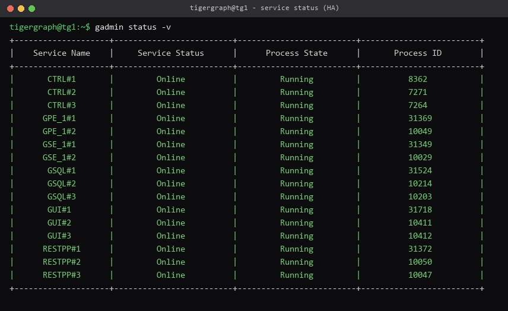
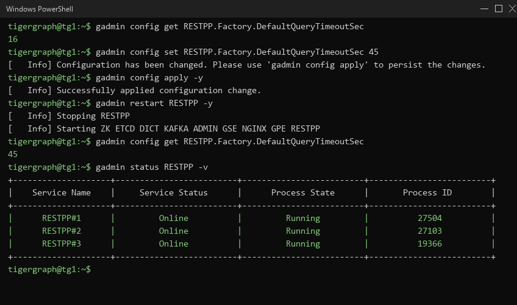
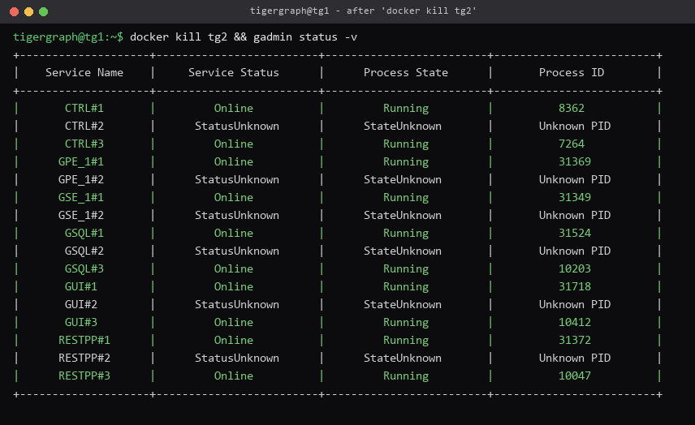
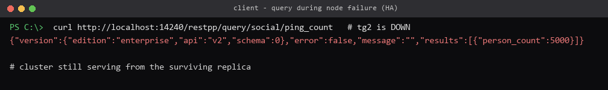

# TigerGraph High-Availability — Node-Failure Test Report

**Product under test:** TigerGraph 4.1.4 (Enterprise), self-hosted **3-node HA cluster**
**Scope:** product behaviour and failure recovery under node failures, with MTTR.

> The assignment specifies 4.1.3; TigerGraph's portal serves only the latest patch
> of the line (4.1.4), which is used here (same 4.1 minor line).

---

## 1. Summary

A 3-node TigerGraph cluster was deployed with **high availability (replication
factor 2)** and tested for how the product *behaves* under node failures — not only
whether it recovers, but which internal services drop, whether queries and loading
jobs keep working, and how fast it recovers (MTTR).

18 test cases cover functional behaviour (service health, GSQL query combinations,
data loading, configuration change), failure behaviour (six node-failure modes,
service-crash inspection, write durability), and negative / boundary conditions.
Evidence: an HTML report, an Allure report, per-test logs, and command screenshots.

**Headline result — HA works, and it is measurable.** Compared with a single-copy
(replication factor 1) baseline, HA turns several node failures into *zero-downtime*
events:

| Failure injected | Non-HA (RF=1) | **HA (RF=2)** — median of 3 runs |
|---|---|---|
| Freeze a node (`docker pause`) | 23 s outage, 87% avail | **0 s, 100% avail** |
| Network partition | 30 s outage, 86% avail | **0 s, 100% avail** |
| Single component (GPE) down | 56 s outage, 86% avail | **0 s, 100% avail** |
| Data-node hard crash (`docker kill`) | 52 s outage, 74% avail | **24 s, 95% avail** |
| Graceful node shutdown | 53 s outage, 74% avail | **24 s, 95% avail** |
| Master / gateway-node crash | 53 s outage, 74% avail | **24 s, 95% avail** |

At RF=1 every node loss is an outage. At RF=2 a replica serves in its place: freeze,
partition and component failures are absorbed entirely (100% availability in all
nine runs), and losing a *live* node — including the master — costs a failover
window of ~24 s median (worst observed 44 s).

---

## 2. Environment

| Item | Detail |
|------|--------|
| Cluster | 3 nodes `tg1/tg2/tg3` as Docker containers on bridge net `tgnet`, static IPs |
| **HA** | **Replication factor 2** — 1 partition, **2 replicas** (`GPE_1#1`, `GPE_1#2`) on separate nodes |
| License | Enterprise, `DataHA: Enable: true` |
| Gateways | each node's REST/GraphStudio gateway published (14240/14241/14242) |
| Data | `Person` (5,000) + `Friendship` (15,000), replicated |
| Harness | Python + pytest, dependencies via `uv`; HTML + Allure reports |

Docker containers make node failure precise and repeatable: `docker kill` (crash),
`docker stop` (graceful), `docker pause` (freeze), `docker network disconnect`
(partition). The suite **auto-detects** the license (`cluster.ha_mode`) and applies
HA expectations only when HA is licensed.



*`gadmin status -v` on the HA cluster — note the replicated `GPE_1#1`/`GPE_1#2`,
`GSE_1#1`/`GSE_1#2`.*

---

## 3. Methodology — how MTTR is measured

An in-process probe queries `ping_count` every **250 ms** from a **surviving
(observer) node**, recording every result. Observing from a node other than the
fault target means any node — including the gateway node — can be failed while
availability is still measured. From the log, relative to the fault-injection time:

| Metric | Definition |
|--------|------------|
| **MTTD** | fault injected → first failed request |
| **Downtime** | first failed request → first sustained success |
| **MTTR** | fault injected → sustained recovery (end of the last outage window) |
| **Availability** | successful / total requests during the scenario window |

Because detection and failover times vary run to run, **each failure scenario was
executed three times** (`scripts/measure_mttr.py`); the report gives the **median**
with the min–max spread. Individual runs are kept under `results/runs/`.

Service behaviour is inspected with `gadmin status -v`; write durability upserts
vertices through a surviving node during the outage and re-checks the count after
recovery. Tests live in `tests/`; raw results in `results/` (`ha_*` for HA,
`noha_*` for the RF=1 baseline); per-test logs in `logs/`.

**Execution model.** The suite runs **sequentially, by design**. Every failure test
mutates the one shared cluster (kills, stops, partitions or restarts the same nodes),
so running them in parallel would let one test's fault corrupt another's measurement —
MTTR and availability would be meaningless. An autouse `healthy_cluster` fixture
restores the cluster to a known-good state before each test, which makes the tests
order-independent but still serial. The read-only functional tests (queries, service
health) are parallel-safe in isolation, but they share the process with the failure
tests, so the suite is kept serial for correct, reproducible measurements.

---

## 4. Test cases and findings

Full case specifications (with preconditions, steps, and API/commands) are in
`TestPlan.xlsx` / `TestPlan.pdf`; manual→automation mapping in
`TraceabilityMatrix.xlsx`.

### 4.1 Functional (positive)

| ID | Test | Result |
|----|------|:------:|
| TC-QL-001 | Point lookup by primary id | PASS |
| TC-QL-002 | 1-hop friendship traversal | PASS |
| TC-QL-003 | Aggregation (count all Person) | PASS |
| TC-QL-004 | 2-hop friendship traversal | PASS |
| TC-SV-001 | All critical services Online | PASS |
| TC-LJ-001 | Loading job from a CSV file source | PASS |
| TC-CFG-001 | Config change (`gadmin config set` → `apply` → `restart all`) | PASS |

**Finding:** all query types return correct, error-free results on the HA cluster,
and a loading job ingests a CSV source and increases the vertex count as expected —
the product's core read and write paths work normally under HA.

**Configuration management (TC-CFG-001):** changing a service configuration variable
(`RESTPP.Factory.DefaultQueryTimeoutSec`) via `gadmin config set` → `gadmin config
apply` → `gadmin restart all` takes effect cleanly — after the restart every critical
service returns `Online` (`gadmin status -v`), the query path keeps serving, and the
new value is reflected by `gadmin config get`. The change is reverted afterwards so
the cluster is left at its baseline.



*`gadmin config set` → `apply` → `restart` → `config get` shows the new value (45)
active and RESTPP back `Online` — configuration management and restart resilience.*

### 4.2 Behaviour under node failure

*(Median of 3 runs per scenario; spread in brackets.)*

| ID | Fault | Downtime | MTTR (median) | MTTR (min–max) | Availability |
|----|-------|---------:|--------------:|---------------:|-------------:|
| TC-NF-001 | Data-node hard crash (`kill tg2`) | 22.9 s | 23.9 s | 23.5–30.5 s | 95% |
| TC-NF-002 | Graceful shutdown (`stop tg2`) | 23.0 s | 23.7 s | 23.7–24.0 s | 95% |
| TC-NF-003 | Freeze (`pause tg3`) | 0 s | — | 0 in all runs | **100%** |
| TC-NF-004 | Network partition (isolate tg3) | 0 s | — | 0 in all runs | **100%** |
| TC-NF-005 | Single-component failure (`stop GPE`) | 0 s | — | 0 in all runs | **100%** |
| TC-NF-006 | Master / gateway-node crash (`kill tg1`) | 22.9 s | 23.9 s | 23.9–44.0 s | 95% |

**Findings:**
- **Freeze, partition and component failure are fully absorbed** — the surviving
  replica served throughout in every run (nine of nine at 100% availability, zero
  downtime). This is the core value of HA.
- **Losing a live node costs a consistent ~24 s failover window** (median across
  crash, graceful stop, and master-node loss) while the cluster detects the loss and
  fails over to the replica — half the ~52 s outage at RF=1, but not zero.
- **Failover time has a tail:** the worst observed recovery was ~44 s (one master-node
  run and one crash run), so detection speed, not the failover itself, dominates the
  variance.
- A graceful stop and a hard crash cost the same — the window is detection + failover,
  not shutdown cleanliness.

**Service behaviour (TC-SV-002):** killing a node takes exactly that node's service
instances down (`GPE_1#2`, `GSE_1#2`, `RESTPP#2`, …) while the peer replicas stay
Online — verified with `gadmin status`. The data path keeps serving from the
surviving replica.



*After `docker kill tg2`: the `#2` service instances show `StatusUnknown`; the
`#1`/`#3` replicas remain `Online`.*



*Same moment, client view: the query still returns `person_count:5000` from the
surviving replica — HA failover in action.*

### 4.3 Write durability (TC-WR-001 / TC-WR-002)

**Finding:** during a clean node **crash**, writes to a surviving replica succeed
(~90% write availability) and **every acknowledged write persists** — no data loss.
During a **network partition** the write path is *ambiguous*: writes acknowledged by
the majority may reconcile with a delay (eventual consistency), so a client cannot
assume a timed-out write did not take effect (see `findings/BUG-002`). The cluster
always recovers to a consistent, serving state.

### 4.4 Negative and boundary

| ID | Test | Finding |
|----|------|---------|
| TC-NG-001 | Invalid GSQL query | Rejected gracefully with an error; the gateway keeps serving — no crash. |
| TC-BD-001 | Two-node failure (kill 2 of 3) | Exceeds RF=2's single-node tolerance; availability is lost while two nodes are down, and the cluster **recovers** once they return. |

---

## 5. Cross-cutting observations

- **HA converts most single-node failures into non-events.** Freeze, partition and
  component loss ran at 100% availability; only losing a *live* node incurs a
  failover window.
- **Recovery cost separates into two classes:** failures a replica can mask
  (freeze/partition/component → zero downtime) versus losing a live node
  (~24 s median failover, up to ~44 s worst case — master included).
- **No acknowledged write is lost on a clean crash;** under a partition, writes are
  eventually consistent (documented finding).
- **Failure is isolated to the failed node's service instances;** replicas on peers
  stay Online, which is what keeps the data path available.
- The **boundary** case (two of three nodes) confirms the tolerance limit: HA
  survives one node, not two, and recovers cleanly afterwards.

## 5a. Bugs raised (with root-cause analysis)

Four defects were found and written up with root-cause analysis in `docs/findings/`
(`BUG-*.md` / `.docx`):

| Bug | Severity | Title |
|-----|----------|-------|
| BUG-001 | Medium | HA license / replication-factor mismatch detected only at cluster init, not precheck |
| BUG-002 | Medium | Writes acknowledged during a partition are not immediately durable (eventual consistency) |
| BUG-003 | Low–Medium | Availability flaps (recovers, then drops again) while a partitioned node rejoins |
| BUG-004 | Low | Failover time (MTTR) for a live-node loss is inconsistent — up to ~2× the median |

---

## 6. Evidence

- **HTML execution report:** `docs/report.html` (per-test expected-vs-observed).
- **Execution results:** `docs/TestExecutionReport.xlsx` (status, MTTR, availability per case).
- **Per-test logs:** `logs/`. Allure (optional): `uv run pytest --alluredir=allure-results`.
- **Screenshots:** `docs/screenshots/` (SS-01…SS-13: service status, HA license,
  GSQL/REST queries, loading job, aggregation, invalid query, services-down-after-kill,
  query-survives-HA, recovered, two-node boundary, full pytest pass, config change + restart).
- **Raw metrics:** `results/ha_*.json` (HA) and `results/noha_*.json` (RF=1 baseline).

---

## 7. Reproducing

```bash
docker compose up -d                 # 3-node cluster (static IPs)
bash scripts/01-install.sh           # install; replication factor auto-selected from the license
bash scripts/load-sample-graph.sh    # schema + data + query endpoints
uv sync                              # test environment
uv run pytest --html=docs/report.html --self-contained-html --alluredir=docs/allure-results
```

Single case: `uv run pytest "tests/test_node_failures.py::test_node_failure[TC-NF-001]"`.
